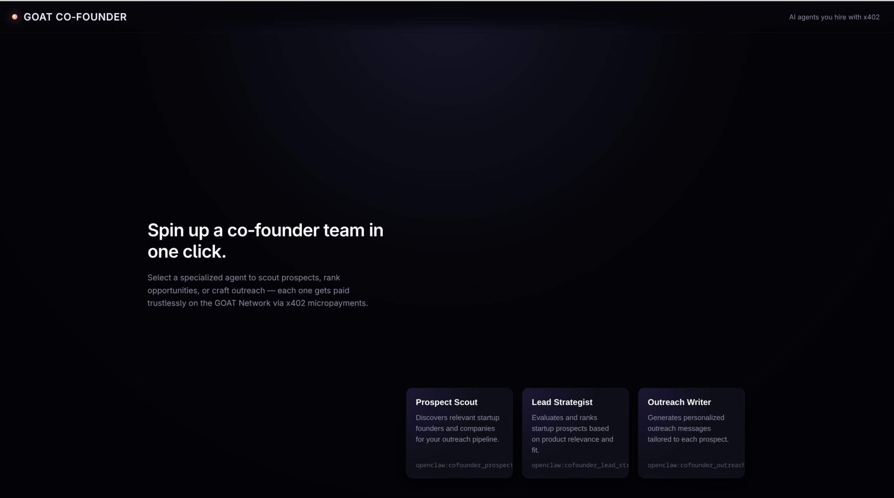
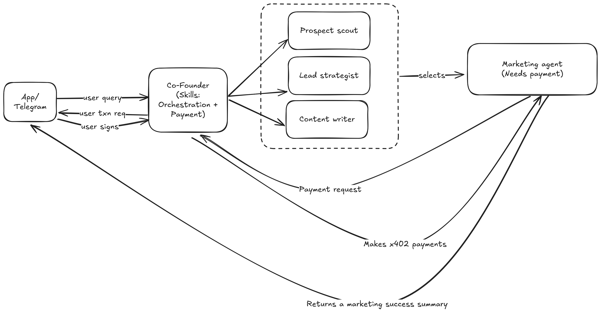

# GOAT Hackathon - AI Marketing Agent Platform

An AI-powered marketing platform where a "Co-Founder" agent orchestrates a team of specialized sub-agents to handle end-to-end marketing campaigns. Users interact through a web app or Telegram, and the system autonomously scouts prospects, develops strategies, generates content, and delegates execution to external marketing agents — paying them via x402 micropayments on-chain. Think of it as an AI marketing team you can hire with a single prompt.

## UI



## Architecture



### Components

- **App / Telegram** — User-facing interface where users submit queries, receive transaction requests, and sign transactions.
- **Co-Founder (Orchestration + Payment)** — Central orchestrator agent that receives user queries, coordinates sub-agents, and handles payment flows.
- **Sub-Agents** (managed by Co-Founder):
  - **Prospect Scout** — Identifies potential marketing targets.
  - **Lead Strategist** — Develops marketing strategies and selects external agents.
  - **Content Writer** — Generates marketing content.
- **Marketing Agent (Needs payment)** — External agent selected by the Lead Strategist. Receives x402 payments, executes marketing tasks, and returns a marketing success summary.

### Flow

1. User submits a query via the App or Telegram.
2. Co-Founder orchestrates sub-agents (Prospect Scout, Lead Strategist, Content Writer).
3. Lead Strategist selects an external Marketing Agent.
4. Co-Founder sends a payment request back to the user; user signs the transaction.
5. x402 payment is made to the Marketing Agent.
6. Marketing Agent returns a success summary to the Co-Founder and the App.

## Development

Built with React + TypeScript + Vite.

```bash
npm install
npm run dev
```
